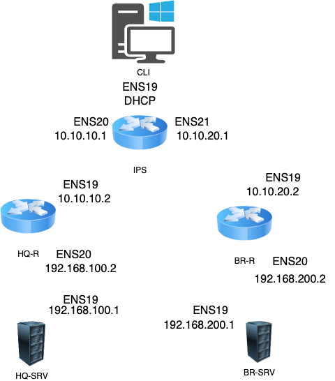

# Задание 2
Настройте внутреннюю динамическую маршрутизацию по средствам FRR. Выберите и обоснуйте выбор протокола динамической маршрутизации из расчета, что в дальнейшем сеть будет масштабироваться.

## Решение
**На ISP**
```bash
apt-get update && apt-get install frr -y   - установка 
  vim /etc/frr/daemons 
    ospfd=yes           – включаем ospf 
  systemctl enable --now frr.service   – запуск службы 
  vtysh               - входим в конфиг 
    conf t 
      router ospf 
      network 10.10.10.0/30 area 10   - сети 
      network 10.10.20.0/30 area 10 
      network 172.20.0.0/16 area 10 
    Ctrl+Z  
      write           - сохраняем
   exit 
  systemctl restart frr.service 
  ip r         
```

**На HQ-R**
```bash
apt-get update && apt-get install frr -y  
  vim /etc/frr/daemons 
    ospfd=yes 
  systemctl enable --now frr.service 
  vtysh 
    conf t 
      router ospf 
      network 10.10.10.0/30 area 10 
      network 192.168.100.0/26 area 10 
    Ctrl+Z 
      write 
  systemctl restart frr.service 
  ip r
```

**На BR-R**
```bash
apt-get update && apt-get install frr -y  
  vim /etc/frr/daemons 
    ospfd=yes 
  systemctl enable --now frr.service 
  vtysh 
    conf t 
      router ospf 
      network 10.10.20.0/30 area 10 
      network 192.168.200.0/28 area 10 
    Ctrl+Z 
      write 
  systemctl restart frr.service 
  ip r 
```

## a. Составьте топологию сети L3.
